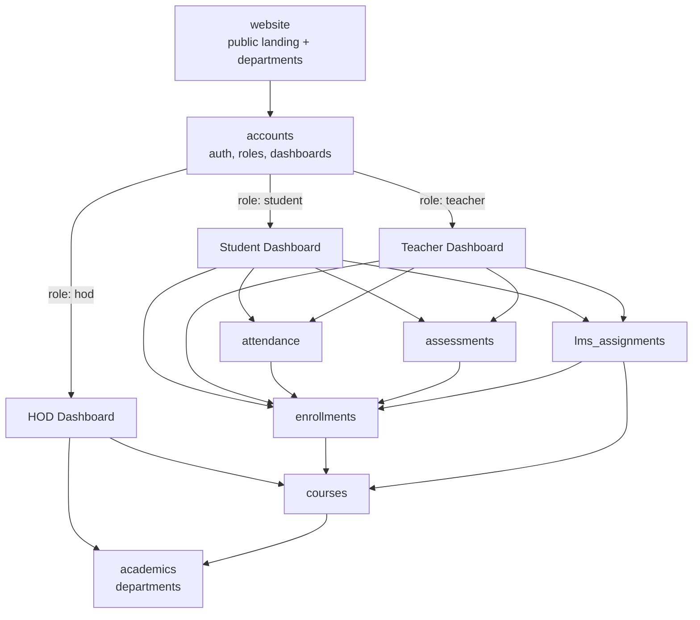
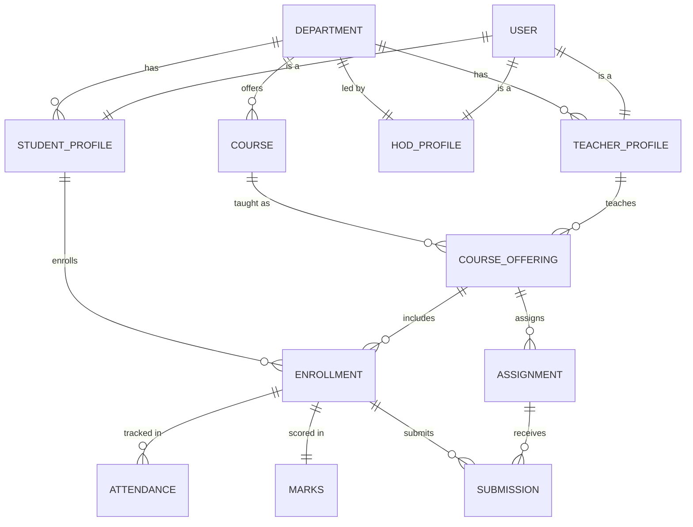
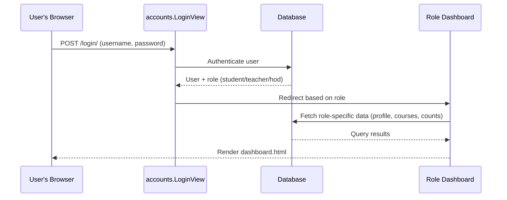
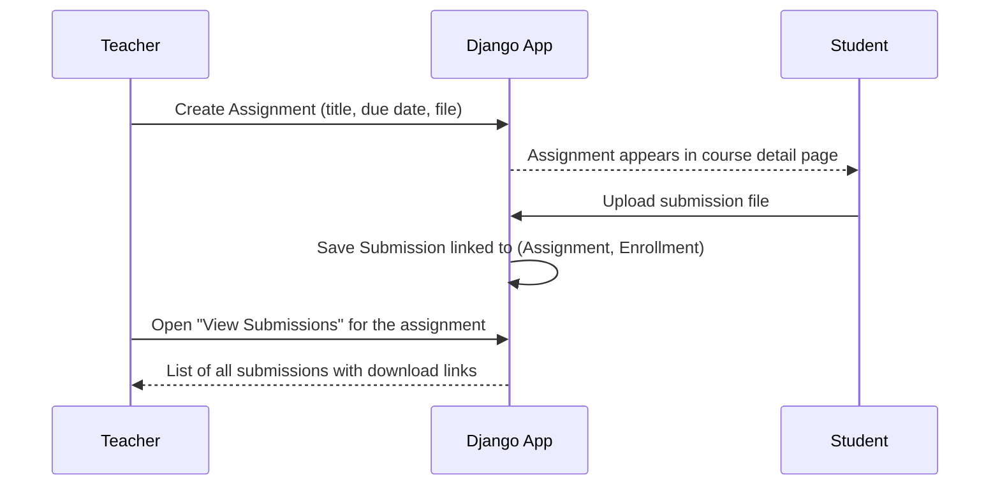
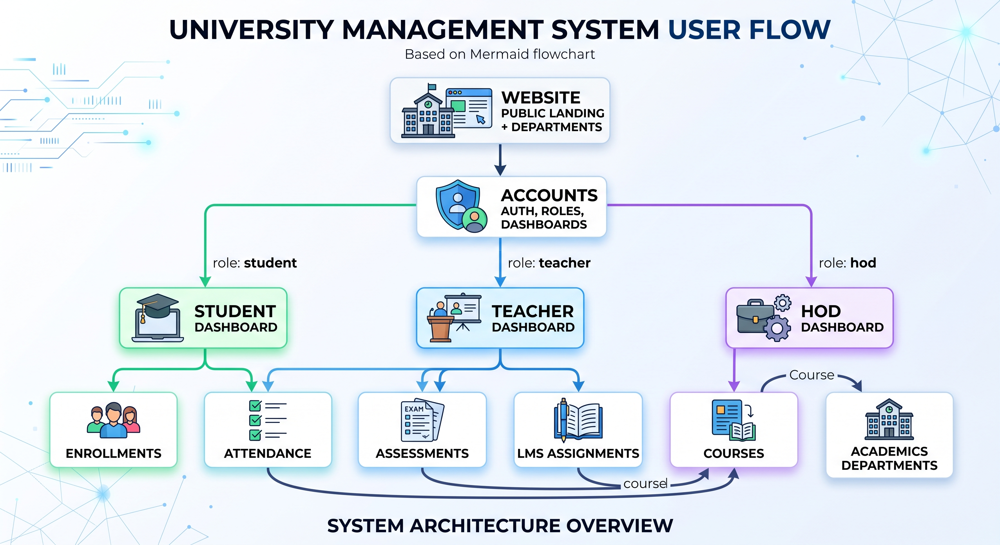
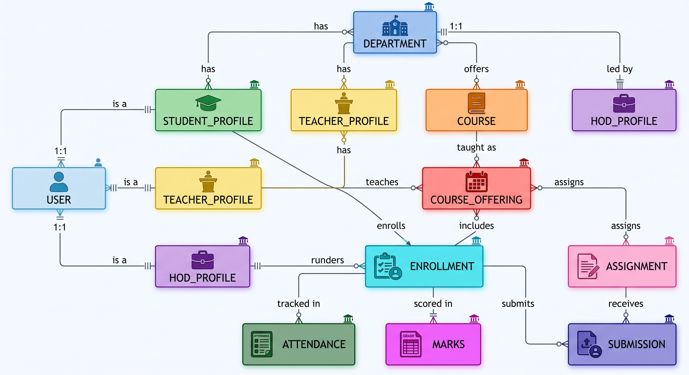
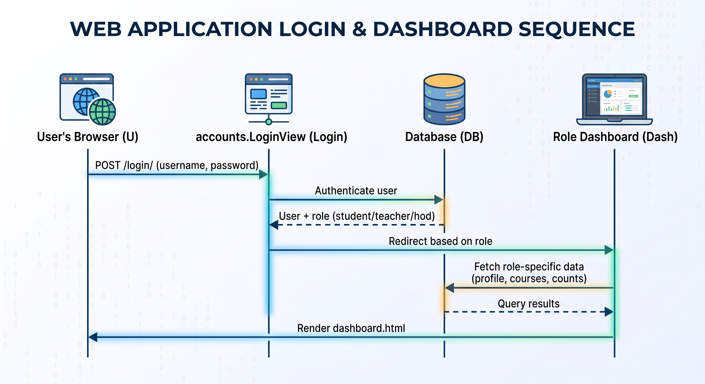
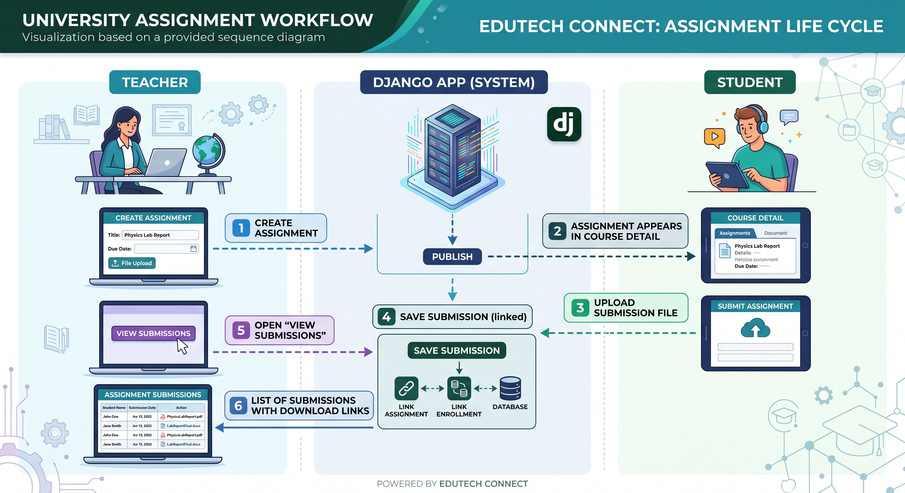

<div align="center">

# Campus Connect LMS

**A role-based Learning Management System built with Django for University of Mianwali**


Students, teachers, and the HOD each get their own dashboard, backed by one shared academic data model — departments, courses, offerings, enrollments, attendance, marks, and assignments.

</div>

---

## Table of Contents

- [Overview](#overview)
- [Why This Project](#why-this-project)
- [Who Does What](#who-does-what)
- [Features](#features)
- [Tech Stack](#tech-stack)
- [Apps Reference](#apps-reference)
- [Architecture](#architecture)
- [Data Model](#data-model)
- [How a Request Flows Through the App](#how-a-request-flows-through-the-app)
- [Example Flow: Submitting and Grading an Assignment](#example-flow-submitting-and-grading-an-assignment)
- [System Architecture & Diagrams](#-system-architecture--diagrams)
- [Project Structure](#project-structure)
- [Getting Started](#getting-started)
- [Environment Variables](#environment-variables)
- [Creating Test Accounts](#creating-test-accounts)
- [Usage Guide](#usage-guide)
- [URL Reference](#url-reference)
- [Running with Docker](#running-with-docker)
- [Author](#author)
- [License](#license)

## Overview

Campus Connect LMS models how a real university department runs a semester, not just a single CRUD app. One Django project, one login page, and three completely different dashboards depending on who logs in:

- The **HOD** manages the department — courses, teachers, students, and who teaches what.
- **Teachers** manage their assigned classes — attendance, assignments, and marks.
- **Students** view their courses, check attendance history, submit assignments, and see their results.
- A public **landing site** introduces the university itself, separate from the LMS login, for visitors who aren't logging in at all.

There is no sign-up form anywhere. Every account — student, teacher, or HOD — is created by an administrator through Django's admin panel, exactly like how a university registrar's office would issue accounts, not how a consumer app would.

## Why This Project

This isn't a tutorial-follow-along CRUD app — it's built around the constraints a real department actually has:

- **Three roles, one login, zero duplicate code paths.** A single `User` model with a `role` field drives everything — one login view, one `LoginView.get_success_url()`, and a `@role_required` decorator that locks every dashboard view to exactly the role it belongs to.
- **The data model mirrors a real academic year, not a toy example.** `Course` (the catalog entry) and `CourseOffering` (that course actually being taught, by a specific teacher, in a specific year) are deliberately separate — because in a real department, a course exists year-round but who teaches it changes every year.
- **Every record a student sees is scoped to their `Enrollment`, not just their identity.** Attendance, marks, and submissions all key off `Enrollment` rather than the student directly, so re-enrolling in a later year never mixes with an old record.
- **Containerized from the start.** A `Dockerfile` and `docker-compose.yml` run the Django app alongside a real PostgreSQL container — not SQLite pretending to be production.
- **Config is never hardcoded.** `SECRET_KEY`, database credentials, and `DEBUG` all come from environment variables via `python-dotenv`, with a `.env.example` committed and the real `.env` gitignored.

## Who Does What

**HOD (Head of Department)**
The department's admin. Logs in, sees department-wide numbers (student count, teacher count, course count, offering count), and is the only role that can create a *course offering* — pairing an existing course with a teacher for a specific academic year. Without an offering, a course exists on paper but no one is actually teaching it that year.

**Teacher**
Sees only the offerings assigned to them. From a class, a teacher can open the student roster, post an assignment (with an optional file), mark daily attendance, and enter sessional/midterm/final marks. Everything a teacher does is scoped to `course_offering.id` in the URL, so a teacher can never see or touch a class that isn't theirs.

**Student**
Sees only the courses they're enrolled in (their `Enrollment` records). From a course, a student can check attendance history and percentage, view marks, and submit an assignment file before its due date.

## Features

**Public site**
- Landing page and a departments overview page — no login required
- Login page that redirects each user straight to the correct dashboard based on their role

**Student**
- Dashboard with quick stats and a profile summary
- Enrolled courses list with a full course detail view
- Attendance history with present / absent / percentage breakdown
- Marks breakdown (sessional, midterm, final, total)
- Assignment submission with file upload

**Teacher**
- List of assigned classes (course offerings)
- Per-class student roster
- Create assignments and review student submissions
- Mark daily attendance per class
- Enter sessional / midterm / final marks per student

**HOD**
- Department-wide overview (student / teacher / course / offering counts)
- Manage teachers and students in the department
- Create course offerings by pairing a course with a teacher for an academic year

## Tech Stack

| Layer | Technology | Why it's here |
|---|---|---|
| Backend | **Django 6** | Batteries-included auth, ORM, and admin panel — no need to hand-roll a user model or a login system |
| Database | **PostgreSQL 15** | Real relational integrity for a schema with heavy foreign-key relationships (Enrollment, Attendance, Marks all cascade correctly) |
| DB Driver | **psycopg 3 / psycopg-binary** | Modern, actively-maintained PostgreSQL adapter for Python |
| Auth | **Django's built-in auth**, extended with a custom `User.role` field | Avoids reinventing session handling, password hashing, and CSRF protection |
| Frontend | **Django templates + hand-written CSS** | No frontend build step — every page is server-rendered, kept intentionally framework-free |
| Config | **python-dotenv** | Keeps `SECRET_KEY` and database credentials out of source control |
| Containerization | **Docker + docker-compose** | Runs the app and a real PostgreSQL instance together with one command, no local Postgres install required |
| Images | **Pillow** | Handles profile picture uploads (`StudentProfile`, `TeacherProfile`, `HODProfile`) |

## Apps Reference

| App | Owns | Used By |
|---|---|---|
| `website` | Public landing page, departments page | Visitors (no login) |
| `accounts` | `User`, `StudentProfile`, `TeacherProfile`, `HODProfile`, login, role-based dashboards | Everyone |
| `academics` | `Department` | HOD, courses, all three profile types |
| `courses` | `Course`, `CourseOffering` | HOD (creates offerings), Teacher (sees their offerings) |
| `enrollments` | `Enrollment` | Student (their courses), everything downstream of it |
| `attendance` | `Attendance` | Teacher (marks it), Student (views it) |
| `assessments` | `Marks` | Teacher (enters it), Student (views it) |
| `lms_assignments` | `Assignment`, `Submission` | Teacher (creates/reviews), Student (submits) |
| `hod` | HOD-facing views for teachers/students/course offerings | HOD only |

## Architecture

The project uses one Django app per bounded concern instead of one giant app. `accounts` owns identity, roles, and the three dashboards; every other app owns one slice of the academic model and is consumed by whichever dashboard needs it.



**Reading this diagram:** the arrows show which app depends on which. `website` only leads to `accounts` (that's the login button). `accounts` branches into three dashboards depending on `User.role`. Each dashboard then pulls in whichever apps its role actually needs — a student never touches the `hod` app, and the HOD never touches `attendance` or `assessments` directly.

## Data Model



**Reading this diagram:** `Enrollment` is the hub everything else hangs off. Attendance, marks, and submissions all key off `Enrollment` — not off the student or the course directly. That's deliberate: it keeps a student's attendance and marks scoped to *one specific offering* of *one specific course* in *one specific academic year*, so re-taking a course in a later year starts a clean record instead of mixing with the old one.

A `Course` is a catalog entry (e.g. "CS301 — Operating Systems"). A `CourseOffering` is that course actually being taught by a specific teacher in a specific year — the thing a student can actually enroll in. This split is why the HOD's "Create Course Offering" page exists: courses are set up once, but offerings are created every academic year.

## How a Request Flows Through the App



Every dashboard view is wrapped in two decorators: `@login_required` (must be logged in at all) and `@role_required("student"/"teacher"/"hod")` (must be logged in **as that specific role**). A student who manually types a teacher's URL gets rejected at the decorator, before any database query even runs.

## Example Flow: Submitting and Grading an Assignment

This is the most common real interaction in the app, end to end:



The `unique_assignment_submission` constraint on the `Submission` model means a student can only submit once per assignment — resubmitting would need the existing row updated, not a new one created.

## 📊 System Architecture & Diagrams

<div align="center">

A visual overview of the LMS architecture, database relationships, and user workflows.

<table>
<tr>
<td width="50%" align="center">

**🧭 User Roles & Dashboard Flow**



How Student, Teacher, and HOD each reach their own dashboard based on `User.role`.

</td>
<td width="50%" align="center">

**🗂️ Entity-Relationship Diagram**



How Departments, Users, Courses, Enrollments, and Assignments relate to each other.

</td>
</tr>
<tr>
<td width="50%" align="center">

**🔐 Login Authentication Sequence**



How the system authenticates a user and redirects them to the correct role-based dashboard.

</td>
<td width="50%" align="center">

**📝 Assignment Workflow**



How a teacher posts an assignment and a student submits their work against it.

</td>
</tr>
</table>

</div>

## Project Structure

```
LMS/
├── apps/
│   ├── accounts/          # custom User model, roles, login, role-based dashboards
│   ├── academics/         # Department
│   ├── courses/           # Course, CourseOffering
│   ├── enrollments/       # Enrollment
│   ├── attendance/        # Attendance
│   ├── assessments/       # Marks
│   ├── lms_assignments/   # Assignment, Submission
│   ├── hod/                # HOD-facing views
│   └── website/           # public landing + departments pages
├── templates/
│   ├── accounts/          # login
│   ├── student/           # student dashboard + pages
│   ├── teacher/           # teacher dashboard + pages
│   ├── hod/               # HOD dashboard + pages
│   ├── index.html         # landing page
│   └── departments.html   # departments detail page
├── static/
│   ├── css/               # style.css (global) + per-page CSS
│   ├── images/
│   └── videos/
├── media/                  # uploaded files (assignments, submissions)
├── config/                 # Django settings, root urls.py
├── manage.py
├── requirements.txt
├── Dockerfile
├── docker-compose.yml
└── .env.example
```

## Getting Started

### 1. Clone and enter the project

```bash
git clone https://github.com/<your-username>/campus-connect-lms.git
cd campus-connect-lms
```

### 2. Create a virtual environment

```bash
python -m venv venv
```

Activate it:

```bash
# Windows (PowerShell)
.\venv\Scripts\Activate.ps1

# macOS / Linux
source venv/bin/activate
```

### 3. Install dependencies

```bash
pip install -r requirements.txt
```

### 4. Configure environment variables

See [Environment Variables](#environment-variables) below, then:

```bash
cp .env.example .env
```

### 5. Run migrations and start the server

```bash
python manage.py migrate
python manage.py createsuperuser
python manage.py runserver
```

Visit `http://127.0.0.1:8000/` for the landing page, or `/admin/` to create departments, courses, and test accounts for each role.

## Environment Variables

The project reads all secrets and database settings from a `.env` file (never committed — see `.gitignore`). Copy `.env.example` to `.env` and fill in real values:

| Variable | What it's for |
|---|---|
| `SECRET_KEY` | Django's cryptographic signing key — generate a random one, never reuse a public example |
| `DEBUG` | `True` for local development, `False` in production |
| `DB_NAME` | PostgreSQL database name |
| `DB_USER` | PostgreSQL username |
| `DB_PASSWORD` | PostgreSQL password |
| `DB_HOST` | Usually `localhost`, or `db` when using docker-compose |
| `DB_PORT` | Usually `5432` |

## Creating Test Accounts

There's no public sign-up — accounts are provisioned by an admin, matching how a real university LMS works:

1. Log in to `/admin/` with your superuser account
2. Create a **Department** first — everything else depends on one existing
3. Create a **Course** under that department
4. Create a **User** with `role` set to `student`, `teacher`, or `hod`
5. Create the matching profile linked to that user and department:
   - `StudentProfile` (needs a `registration_no`)
   - `TeacherProfile` (needs an `employee_id`)
   - `HODProfile` (one per department)
6. As the HOD, create a **Course Offering** (pairs the course with a teacher for an academic year)
7. Create an **Enrollment** linking the student to that offering
8. Log in at `/login/` with the student/teacher/hod account — you'll land on the correct dashboard automatically

## Usage Guide

**As the HOD:**
Log in → dashboard shows department counts → "Course Offerings" to see what's being taught → "Create Course Offering" to assign a teacher to a course for the current academic year → "Teachers" / "Students" to browse the department roster.

**As a Teacher:**
Log in → "My Classes" lists your offerings → open a class → "Students" for the roster, "Assignments" to post work and review submissions, "Attendance" to mark today's date present/absent per student, "Enter Marks" to record sessional/midterm/final scores.

**As a Student:**
Log in → dashboard → "My Courses" → open a course → view info, check "Attendance" for your percentage, check "Marks" for your scores, or submit an assignment directly from the course page.

## URL Reference

| URL | Role | Purpose |
|---|---|---|
| `/` | Public | Landing page |
| `/departments/` | Public | Departments overview |
| `/login/` | Public | Login (redirects by role) |
| `/logout/` | Any | Logout |
| `/student/dashboard/` | Student | Student dashboard |
| `/teacher/dashboard/` | Teacher | Teacher dashboard |
| `/hod/dashboard/` | HOD | HOD dashboard |

(Full URL list is in each app's `urls.py` — these are the entry points per role.)

## Running with Docker

```bash
docker-compose up --build
```

This starts the Django app alongside a PostgreSQL container, using the same `.env` file — no local Postgres install needed.

## Author

**Danish Hassan**
Computer Science graduate, University of Mianwali

- GitHub: [github.com/danish-niazi-007](https://github.com/danish-niazi-007)
- LinkedIn: [linkedin.com/in/danish-hassan-dev](https://linkedin.com/in/danish-hassan-dev)

## License

This project is available for learning and portfolio reference. If you'd like to reuse it, please credit the author.
